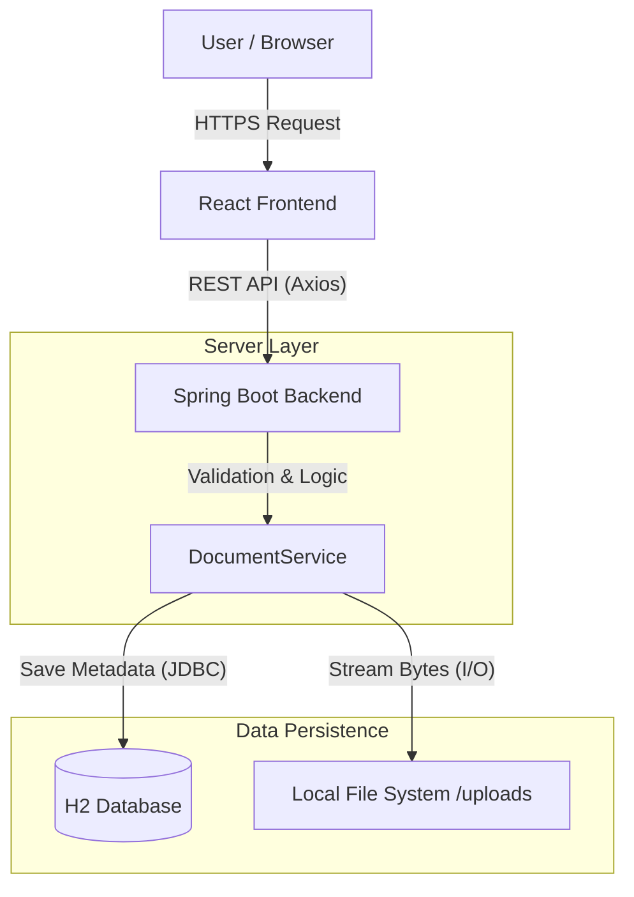

# Patient Portal - Design Document

## 1. Tech Stack Choices

### Q1. Frontend: React.js (Vite)
* **Choice:** React.js initialized with Vite.
* **Justification:** React's component-based architecture allows for a modular and reusable UI (separating the Upload Form from the Document List). I specifically chose **Vite** over Create-React-App for its superior build performance and lighter development footprint. The application uses modern CSS (Flexbox/Grid) for a responsive layout without relying on heavy external UI libraries.

### Q2. Backend: Java Spring Boot
* **Choice:** Spring Boot 3.4 (Java 17).
* **Justification:** Spring Boot is the enterprise standard for building robust, scalable REST APIs. It was chosen for:
    * **Strict Type Safety:** Critical for healthcare data to prevent runtime type errors.
    * **Dependency Injection:** Ensures code is testable and loosely coupled.
    * **Embedded Server (Tomcat):** Makes the application easy to run locally without complex server configuration.
    * **Multipart Support:** Native support for efficient file streaming.

### Q3. Database: H2 Database
* **Choice:** H2 (In-Memory / File-based Persistence).
* **Justification:** The assignment allows for "SQLite or similar." I chose H2 because it mimics the behavior of enterprise SQL databases (like PostgreSQL) but requires **zero installation** for the reviewer. It runs entirely within the JVM, ensuring the code works on any machine immediately.

### Q4. Scaling to 1,000 Users
To scale from this local prototype to 1,000+ concurrent users, I would implement the following changes:
1.  **Storage:** Migrate from local disk storage (`uploads/`) to Cloud Object Storage (e.g., AWS S3 or Azure Blob) to handle infinite scale and provide redundancy.
2.  **Database:** Migrate from H2 to a managed PostgreSQL instance to handle higher concurrency and ensure data integrity.
3.  **Security:** Implement Spring Security with OAuth2/OIDC (e.g., Auth0 or Keycloak) to ensure users can only access their own documents.
4.  **Caching:** Implement Redis to cache file metadata for frequently accessed documents.

## 2. Architecture Overview

### High-Level Diagram
The system follows a standard 3-Tier Web Architecture.

## 3. API Specification

| Endpoint | Method | Description | Request Body | Response |
| :--- | :--- | :--- | :--- | :--- |
| `/api/documents/upload` | `POST` | Upload PDF | `FormData` (key: `file`) | `{ "message": "Success", "id": 1 }` |
| `/api/documents` | `GET` | List all files | None | `[{ "id": 1, "filename": "report.pdf", "size": 1024 }]` |
| `/api/documents/{id}` | `GET` | Download file | None | Binary File Stream (`application/pdf`) |
| `/api/documents/{id}` | `DELETE` | Delete file | None | `{ "message": "Deleted successfully" }` |

## 4. Data Flow Description (Q5)

### Scenario A: File Upload
1.  **Selection:** User selects a file via the React UI. Frontend validates the `.pdf` extension.
2.  **Transmission:** React sends a `POST` request with `MultipartFile` data to the Backend.
3.  **Validation:** Spring Boot Controller intercepts the request. The Service layer validates the MIME type is strictly `application/pdf`.
4.  **Storage:** The Service generates a UUID-based unique filename to prevent overwrites and streams the file bytes to the local `uploads/` directory.
5.  **Metadata:** The Service saves the original filename, file path, size, and timestamp to the H2 Database.
6.  **Confirmation:** Server returns `200 OK`, and the Frontend refreshes the list.

### Scenario B: File Download
1.  **Request:** User clicks "Download". Frontend requests `/api/documents/{id}`.
2.  **Lookup:** Backend searches the Database for the file path associated with that ID.
3.  **Streaming:** The file is read from the disk and wrapped in a `Resource` object.
4.  **Delivery:** The response header `Content-Disposition: attachment` is set with the original filename, triggering a browser download dialog.

## 5. Assumptions (Q6)
1.  **Single Tenant:** The system assumes a single-user environment as per the prompt; no authentication middleware is implemented.
2.  **File Integrity:** It is assumed the host machine has write permissions for the application directory (`uploads/`).
3.  **PDF Validation:** We assume checking the MIME type `application/pdf` is sufficient for this scope, without deep binary content inspection.